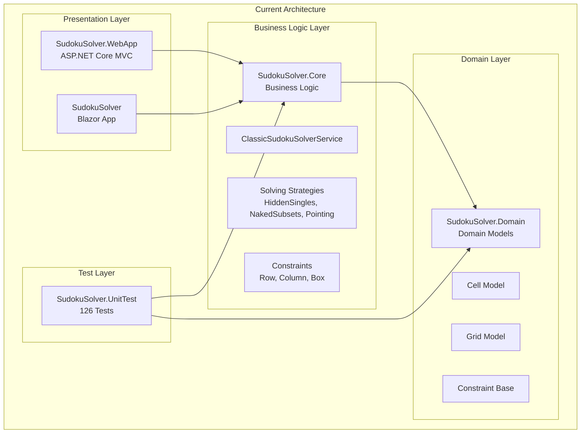
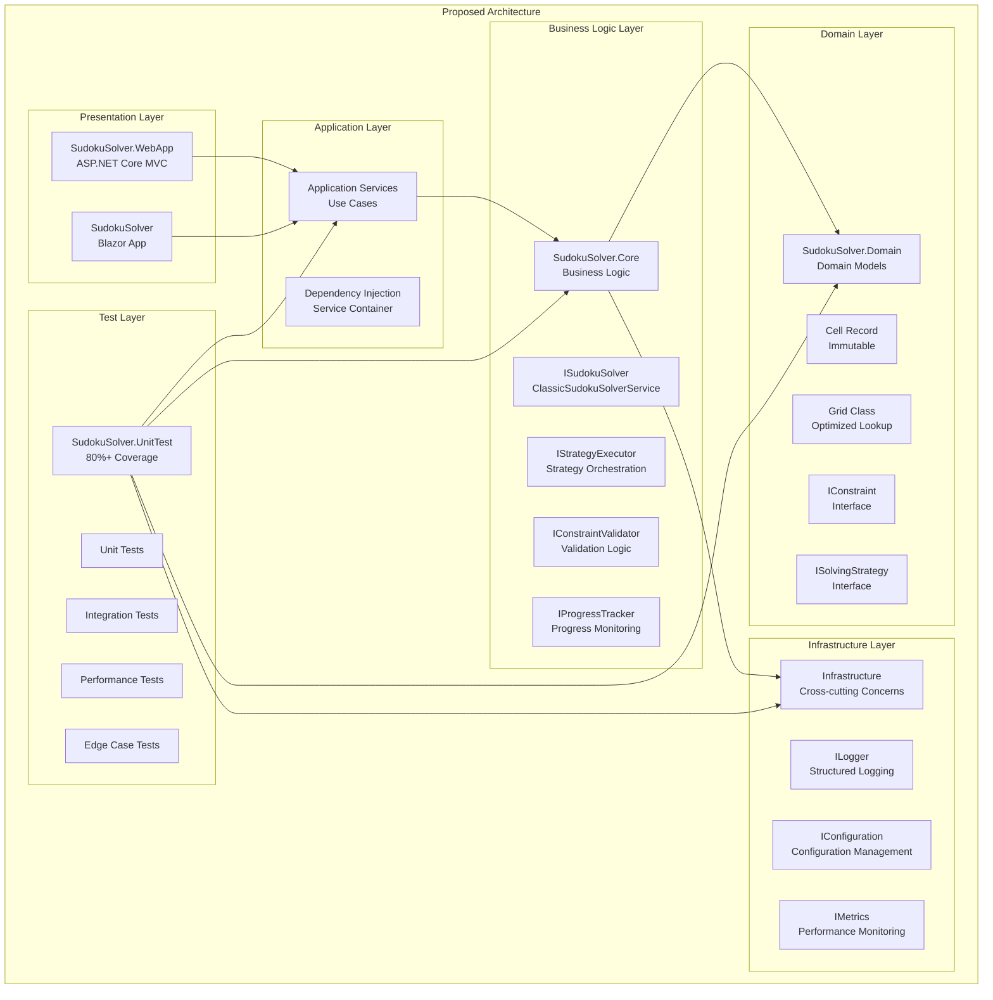
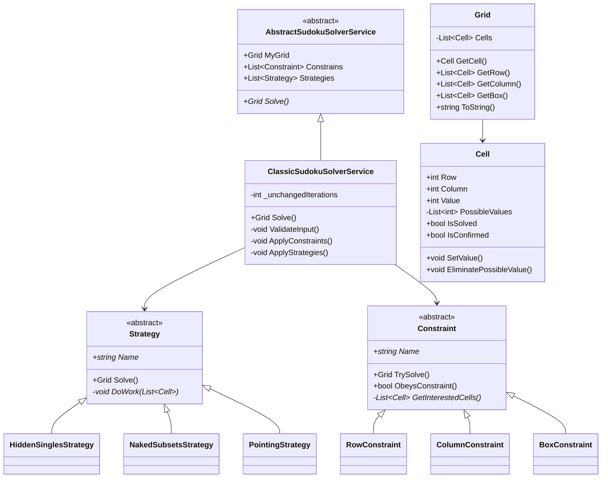
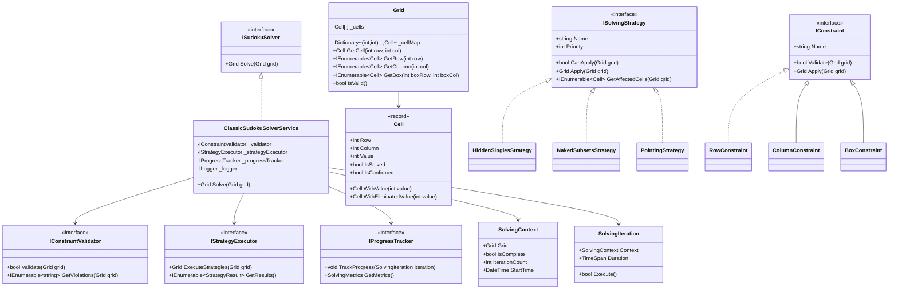
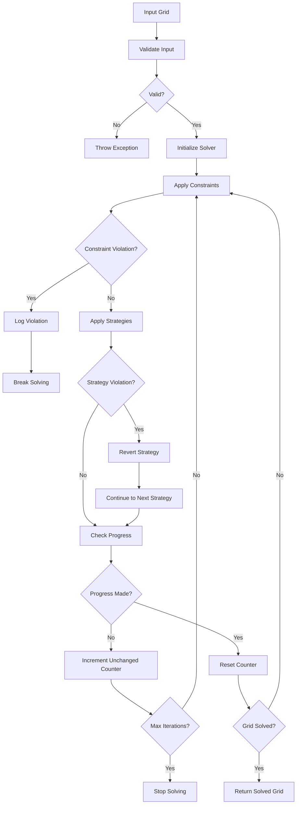
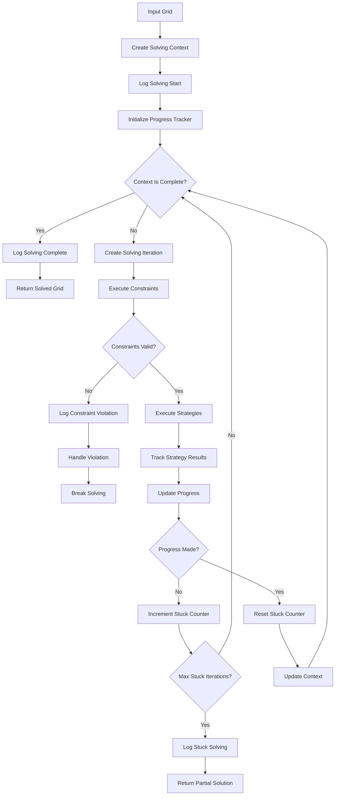
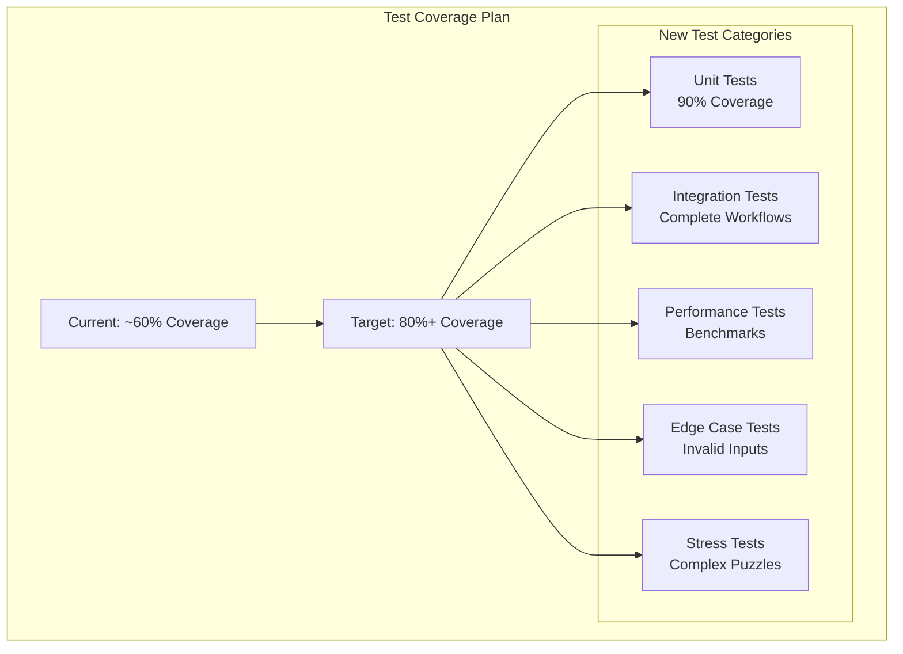
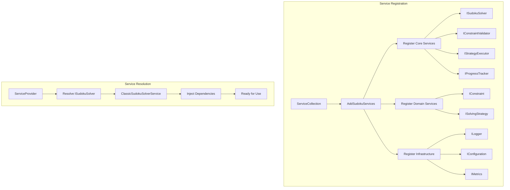
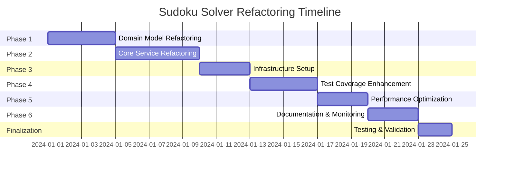

# Architecture Diagrams for Sudoku Solver Refactoring

## Current Architecture



## Proposed Architecture



## Current vs Proposed Class Relationships

### Current Class Structure



### Proposed Class Structure



## Data Flow Diagrams

### Current Solving Process



### Proposed Solving Process



## Performance Comparison

### Current Performance Characteristics

```mermaid
graph LR
    subgraph "Current Performance Issues"
        A[O(n) Cell Lookup<br/>Linear Search]
        B[Inefficient Grouping<br/>Multiple LINQ Queries]
        C[No Caching<br/>Repeated Calculations]
        D[Mutable State<br/>Thread Safety Issues]
    end
```

### Proposed Performance Improvements

```mermaid
graph LR
    subgraph "Proposed Performance Gains"
        A[O(1) Cell Lookup<br/>Dictionary Access]
        B[Optimized Grouping<br/>Cached Collections]
        C[Smart Caching<br/>Lazy Loading]
        D[Immutable State<br/>Thread Safe]
    end
```

## Test Coverage Strategy



## Dependency Injection Architecture



## Migration Strategy

