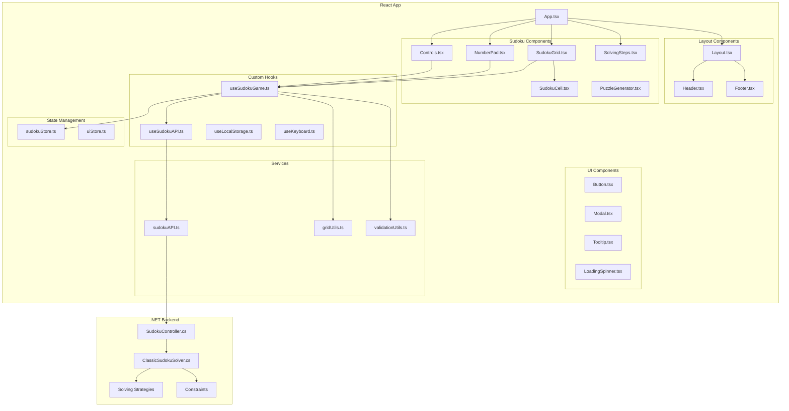
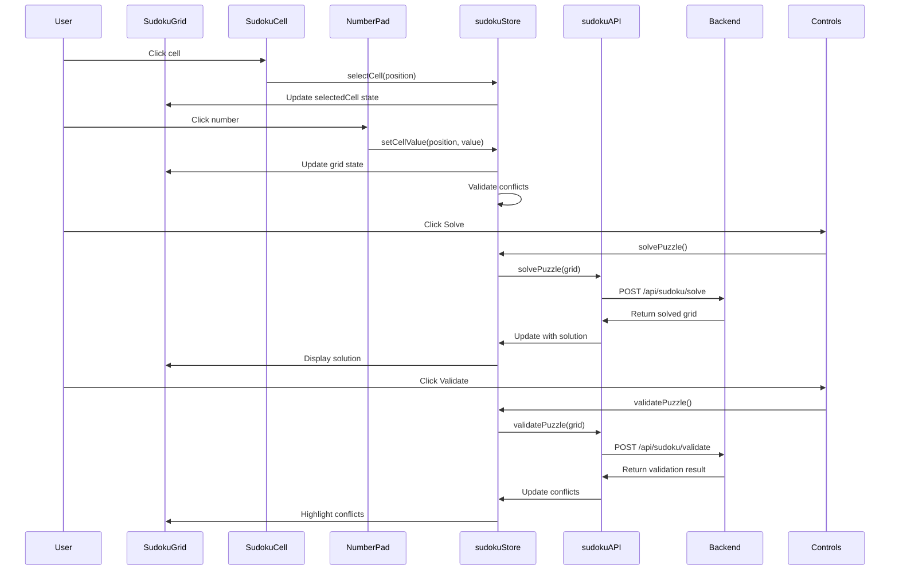
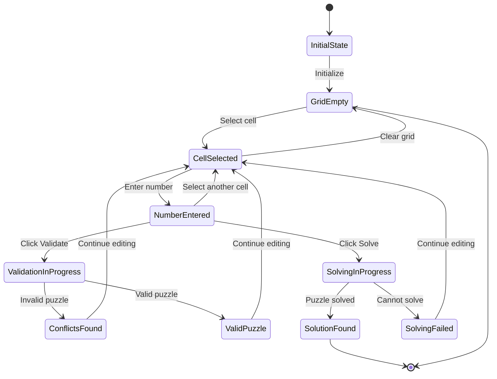

# PLAN-001: React TypeScript Sudoku Solver Implementation

## Project Overview
Create a modern React + TypeScript frontend application for the existing Sudoku solver backend, replacing the current Blazor UI with a more interactive and responsive interface.

## Current System Analysis

### Backend Architecture
- **Core Engine**: ClassicSudokuSolver with 6 solving strategies
- **Strategies**: Hidden Singles, Naked Subsets, Pointing, X-Wing, Swordfish, X-Y Wing
- **Constraints**: Row, Column, Box constraints
- **API Endpoints**: `/api/sudoku/solve`, `/api/sudoku/validate`
- **Data Model**: Grid (9x9) with Cell objects containing values and possible values

### Current Limitations
- Basic Blazor UI with minimal interactivity
- No real-time validation feedback
- No solving step visualization
- Limited mobile responsiveness
- No puzzle generation capabilities

## Target Architecture

### Frontend Stack
- **Framework**: React 18 with TypeScript
- **Build Tool**: Vite
- **State Management**: Zustand (lightweight, perfect for game state)
- **Styling**: Tailwind CSS + Headless UI
- **HTTP Client**: Axios
- **Testing**: Vitest + React Testing Library
- **Linting**: ESLint + Prettier

### Component Architecture Diagram



### Data Flow Diagram



### State Management Flow



### Project Structure
```
SudokuSolver.ReactApp/
├── src/
│   ├── components/
│   │   ├── sudoku/
│   │   │   ├── SudokuGrid.tsx
│   │   │   ├── SudokuCell.tsx
│   │   │   ├── NumberPad.tsx
│   │   │   ├── Controls.tsx
│   │   │   ├── SolvingSteps.tsx
│   │   │   └── PuzzleGenerator.tsx
│   │   ├── ui/
│   │   │   ├── Button.tsx
│   │   │   ├── Modal.tsx
│   │   │   ├── Tooltip.tsx
│   │   │   └── LoadingSpinner.tsx
│   │   └── layout/
│   │       ├── Header.tsx
│   │       ├── Footer.tsx
│   │       └── Layout.tsx
│   ├── hooks/
│   │   ├── useSudokuGame.ts
│   │   ├── useSudokuAPI.ts
│   │   ├── useLocalStorage.ts
│   │   └── useKeyboard.ts
│   ├── stores/
│   │   ├── sudokuStore.ts
│   │   └── uiStore.ts
│   ├── services/
│   │   ├── api/
│   │   │   ├── sudokuAPI.ts
│   │   │   └── types.ts
│   │   └── utils/
│   │       ├── gridUtils.ts
│   │       ├── validationUtils.ts
│   │       └── puzzleGenerator.ts
│   ├── types/
│   │   ├── sudoku.ts
│   │   ├── api.ts
│   │   └── ui.ts
│   ├── styles/
│   │   ├── index.css
│   │   └── components.css
│   ├── App.tsx
│   ├── main.tsx
│   └── vite-env.d.ts
├── public/
│   ├── favicon.ico
│   └── index.html
├── package.json
├── tsconfig.json
├── vite.config.ts
├── tailwind.config.js
├── eslint.config.js
├── prettier.config.js
└── README.md
```

## Implementation Plan

### Phase 1: Project Setup and Core Infrastructure ✅
[x] Initialize React + TypeScript project with Vite
[x] Configure Tailwind CSS and Headless UI
[x] Set up ESLint and Prettier
[x] Configure testing environment (Vitest + RTL)
[x] Set up project structure and base files
[x] Configure build and development scripts

### Phase 2: Type Definitions and API Integration
[ ] Define TypeScript interfaces for Sudoku data models
[ ] Create API service layer with Axios
[ ] Implement error handling and loading states
[ ] Create API response type definitions
[ ] Set up API base configuration

### Phase 3: State Management
[ ] Implement Zustand store for game state
[ ] Create UI state management
[ ] Implement local storage persistence
[ ] Set up state synchronization between components

### Phase 4: Core Components Development
[ ] Create SudokuCell component with selection and input handling
[ ] Implement SudokuGrid component with 9x9 layout
[ ] Build NumberPad component for number input
[ ] Create Controls component (Solve, Validate, Clear, New Game)
[ ] Implement responsive design for mobile/tablet/desktop

### Phase 5: Game Logic and Validation
[ ] Implement real-time grid validation
[ ] Create conflict highlighting system
[ ] Build input validation and constraints
[ ] Implement undo/redo functionality
[ ] Add keyboard navigation support

### Phase 6: Solving and Visualization
[ ] Integrate with backend solving API
[ ] Create solving step visualization
[ ] Implement progress indicators
[ ] Add solving strategy explanations
[ ] Create solving animation system

### Phase 7: Advanced Features
[ ] Implement puzzle generation
[ ] Add difficulty levels
[ ] Create hint system
[ ] Implement timer and statistics
[ ] Add save/load functionality

### Phase 8: UI/UX Polish
[ ] Implement dark/light theme toggle
[ ] Add accessibility features (ARIA labels, keyboard navigation)
[ ] Create loading states and error handling
[ ] Implement responsive design optimizations
[ ] Add animations and transitions

### Phase 9: Testing and Quality Assurance
[ ] Write unit tests for core components
[ ] Implement integration tests for game logic
[ ] Add E2E tests for critical user flows
[ ] Performance testing and optimization
[ ] Cross-browser compatibility testing

### Phase 10: Deployment and Documentation
[ ] Configure production build
[ ] Set up CI/CD pipeline
[ ] Create comprehensive documentation
[ ] Performance optimization
[ ] Final testing and bug fixes

## Technical Specifications

### Component Specifications

#### SudokuGrid Component
```typescript
interface SudokuGridProps {
  grid: SudokuGrid;
  selectedCell: CellPosition | null;
  onCellSelect: (position: CellPosition) => void;
  onCellValueChange: (position: CellPosition, value: number) => void;
  conflicts: CellPosition[];
  isSolving: boolean;
  solvingSteps: SolvingStep[];
}
```

#### SudokuCell Component
```typescript
interface SudokuCellProps {
  cell: Cell;
  position: CellPosition;
  isSelected: boolean;
  hasConflict: boolean;
  isHighlighted: boolean;
  isLocked: boolean;
  onClick: () => void;
  onValueChange: (value: number) => void;
}
```

#### NumberPad Component
```typescript
interface NumberPadProps {
  onNumberSelect: (number: number) => void;
  onClear: () => void;
  onUndo: () => void;
  onRedo: () => void;
  canUndo: boolean;
  canRedo: boolean;
}
```

### State Management (Zustand)

#### Sudoku Store
```typescript
interface SudokuState {
  // Grid state
  grid: SudokuGrid;
  originalGrid: SudokuGrid;
  
  // Game state
  selectedCell: CellPosition | null;
  conflicts: CellPosition[];
  isSolving: boolean;
  solvingSteps: SolvingStep[];
  
  // Actions
  setCellValue: (position: CellPosition, value: number) => void;
  selectCell: (position: CellPosition) => void;
  clearGrid: () => void;
  solvePuzzle: () => Promise<void>;
  validatePuzzle: () => Promise<void>;
  newGame: (difficulty: Difficulty) => void;
  undo: () => void;
  redo: () => void;
}
```

#### UI Store
```typescript
interface UIState {
  // Theme
  theme: 'light' | 'dark';
  
  // Modal states
  showSettings: boolean;
  showHelp: boolean;
  showStatistics: boolean;
  
  // Actions
  toggleTheme: () => void;
  setModalState: (modal: string, show: boolean) => void;
}
```

### API Integration

#### API Service
```typescript
class SudokuAPI {
  private baseURL: string;
  
  async solvePuzzle(grid: number[]): Promise<SolveResponse>;
  async validatePuzzle(grid: number[]): Promise<ValidateResponse>;
  async generatePuzzle(difficulty: Difficulty): Promise<GenerateResponse>;
}
```

### Responsive Design Strategy

#### Breakpoints
- **Mobile**: < 768px (single column layout)
- **Tablet**: 768px - 1024px (compact layout)
- **Desktop**: > 1024px (full layout with sidebar)

#### Mobile Optimizations
- Touch-friendly cell sizes (minimum 44px)
- Swipe gestures for number input
- Optimized grid layout for small screens
- Collapsible controls panel

## Risk Analysis and Mitigation

### Technical Risks
1. **Performance Issues with Large Grid Updates**
   - **Risk**: Frequent re-renders causing lag
   - **Mitigation**: Use React.memo, useMemo, and useCallback optimizations

2. **State Management Complexity**
   - **Risk**: Complex state synchronization between components
   - **Mitigation**: Use Zustand for centralized state, implement proper state normalization

3. **API Integration Issues**
   - **Risk**: Backend API changes or compatibility issues
   - **Mitigation**: Implement proper error handling, create API abstraction layer

4. **Mobile Responsiveness**
   - **Risk**: Poor user experience on mobile devices
   - **Mitigation**: Mobile-first design approach, extensive mobile testing

### Business Risks
1. **User Adoption**
   - **Risk**: Users prefer existing Blazor interface
   - **Mitigation**: Conduct user testing, gather feedback, iterative improvements

2. **Development Timeline**
   - **Risk**: Project delays due to complexity
   - **Mitigation**: Phased approach, MVP first, continuous delivery

## Testing Strategy

### Unit Testing
- Component rendering and interactions
- State management logic
- Utility functions
- API service methods

### Integration Testing
- Game flow from start to completion
- API integration scenarios
- State persistence and recovery

### E2E Testing
- Complete puzzle solving workflow
- Mobile responsiveness
- Cross-browser compatibility

### Performance Testing
- Large grid updates
- Memory usage optimization
- Bundle size analysis

## Success Metrics

### Technical Metrics
- [ ] Lighthouse score > 90 for all categories
- [ ] Bundle size < 500KB gzipped
- [ ] First Contentful Paint < 1.5s
- [ ] Time to Interactive < 3s

### User Experience Metrics
- [ ] Mobile usability score > 95
- [ ] Accessibility compliance (WCAG 2.1 AA)
- [ ] Cross-browser compatibility (Chrome, Firefox, Safari, Edge)

### Functional Metrics
- [ ] All solving strategies working correctly
- [ ] Real-time validation response < 100ms
- [ ] Puzzle generation working for all difficulty levels

## Implementation Checklist

### Phase 1: Project Setup
[ ] Create new React + TypeScript project with Vite
[ ] Install and configure Tailwind CSS
[ ] Set up Headless UI components
[ ] Configure ESLint and Prettier
[ ] Set up testing environment
[ ] Create basic project structure

### Phase 2: Core Infrastructure
[ ] Define TypeScript interfaces
[ ] Create API service layer
[ ] Implement Zustand stores
[ ] Set up routing (if needed)
[ ] Configure build scripts

### Phase 3: Basic Components
[ ] Create SudokuCell component
[ ] Implement SudokuGrid component
[ ] Build NumberPad component
[ ] Create basic Controls component
[ ] Implement responsive layout

### Phase 4: Game Logic
[ ] Implement cell selection
[ ] Add number input handling
[ ] Create validation system
[ ] Integrate with solving API
[ ] Add conflict highlighting

### Phase 5: Advanced Features
[ ] Implement solving visualization
[ ] Add puzzle generation
[ ] Create hint system
[ ] Implement save/load functionality
[ ] Add statistics tracking

### Phase 6: Polish and Testing
[ ] Add animations and transitions
[ ] Implement accessibility features
[ ] Write comprehensive tests
[ ] Performance optimization
[ ] Cross-browser testing

### Phase 7: Deployment
[ ] Configure production build
[ ] Set up CI/CD pipeline
[ ] Create documentation
[ ] Final testing and bug fixes
[ ] Deploy to production

## Finalization Action
[ ] Complete all phases and deliver fully functional React + TypeScript Sudoku solver application
[ ] Ensure all success metrics are met
[ ] Provide comprehensive documentation and deployment instructions
[ ] Conduct final user acceptance testing
[ ] Hand over to maintenance team 