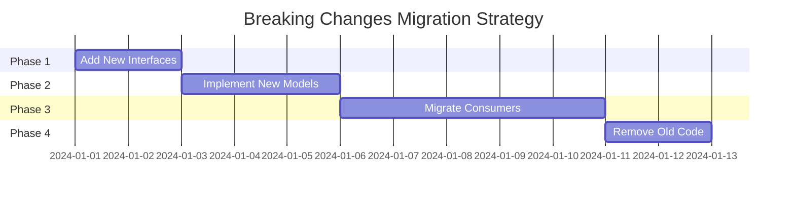
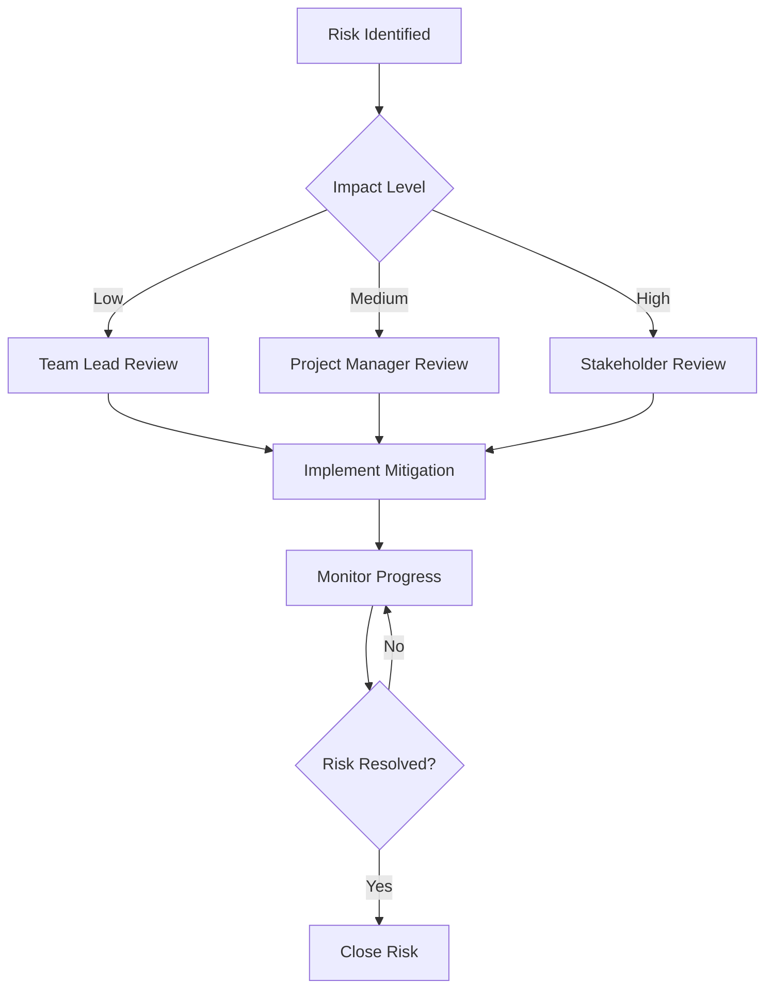

# Risk Assessment and Mitigation Plan for Sudoku Solver Refactoring

## Executive Summary

This document provides a comprehensive risk assessment for the Sudoku solver codebase refactoring project. It identifies potential risks, their impact levels, probability of occurrence, and detailed mitigation strategies to ensure project success.

## Risk Assessment Matrix

| Risk Category | Risk Level | Impact | Probability | Mitigation Priority |
|---------------|------------|--------|-------------|-------------------|
| Breaking Changes | High | High | Medium | Critical |
| Performance Regression | High | High | Medium | Critical |
| Test Coverage Drop | Medium | High | Low | High |
| Scope Creep | Medium | Medium | Medium | Medium |
| Integration Issues | Medium | Medium | Low | Medium |
| Documentation Gaps | Low | Low | Medium | Low |

## Detailed Risk Analysis

### 1. Breaking Changes (High Risk)

#### Risk Description
Introducing breaking changes that cause existing functionality to fail or existing tests to break.

#### Impact Analysis
- **Severity**: Critical
- **Scope**: All existing functionality
- **Detection Time**: Immediate (test failures)
- **Recovery Time**: 1-3 days

#### Root Causes
- Refactoring domain models (Cell, Grid)
- Changing interface contracts
- Modifying public APIs
- Altering behavior of core algorithms

#### Mitigation Strategies

##### 1.1 Backward Compatibility
```csharp
// Phase 1: Add new interfaces alongside existing classes
public interface ICell
{
    int Row { get; }
    int Column { get; }
    int Value { get; }
    bool IsSolved { get; }
    bool IsConfirmed { get; }
}

// Phase 2: Implement new interfaces in existing classes
public class Cell : ICell
{
    // Existing implementation
    // New interface implementation
}

// Phase 3: Gradually migrate consumers
// Phase 4: Remove old implementations
```

##### 1.2 Feature Flags
```csharp
public class SudokuSolverConfiguration
{
    public bool UseNewCellModel { get; set; } = false;
    public bool UseNewGridModel { get; set; } = false;
    public bool UseNewConstraintSystem { get; set; } = false;
}
```

##### 1.3 Comprehensive Testing
- [ ] Maintain all existing 126 tests
- [ ] Add integration tests for complete workflows
- [ ] Implement regression testing
- [ ] Use test-driven development approach

##### 1.4 Gradual Migration


#### Contingency Plan
- **Immediate**: Revert to last working commit
- **Short-term**: Fix breaking changes within 24 hours
- **Long-term**: Implement proper migration strategy

### 2. Performance Regression (High Risk)

#### Risk Description
Refactoring changes that result in slower solving times or higher memory usage.

#### Impact Analysis
- **Severity**: Critical
- **Scope**: All solving operations
- **Detection Time**: Performance testing
- **Recovery Time**: 2-5 days

#### Root Causes
- Inefficient new algorithms
- Memory leaks from new implementations
- Over-engineering of solutions
- Loss of optimization during refactoring

#### Mitigation Strategies

##### 2.1 Performance Benchmarks
```csharp
public class PerformanceBenchmarks
{
    public static readonly TimeSpan EasyPuzzleMaxTime = TimeSpan.FromMilliseconds(100);
    public static readonly TimeSpan MediumPuzzleMaxTime = TimeSpan.FromMilliseconds(500);
    public static readonly TimeSpan HardPuzzleMaxTime = TimeSpan.FromMilliseconds(2000);
    public static readonly TimeSpan ExpertPuzzleMaxTime = TimeSpan.FromMilliseconds(10000);
    
    public static readonly long MaxMemoryUsageBytes = 50 * 1024 * 1024; // 50MB
}
```

##### 2.2 Continuous Performance Monitoring
```csharp
public interface IPerformanceMonitor
{
    void RecordSolvingTime(TimeSpan duration);
    void RecordMemoryUsage(long bytes);
    void RecordStrategyPerformance(string strategyName, TimeSpan duration);
    PerformanceReport GenerateReport();
}
```

##### 2.3 Performance Testing Pipeline
```yaml
# .github/workflows/performance-test.yml
name: Performance Tests
on: [push, pull_request]
jobs:
  performance:
    runs-on: ubuntu-latest
    steps:
      - uses: actions/checkout@v2
      - name: Run Performance Tests
        run: dotnet test --filter Category=Performance
      - name: Compare Benchmarks
        run: dotnet run --project PerformanceBenchmark
```

##### 2.4 Optimization Strategy
- [ ] Profile existing code before refactoring
- [ ] Set performance budgets for each component
- [ ] Implement performance regression tests
- [ ] Use performance profiling tools

#### Contingency Plan
- **Immediate**: Revert performance-degrading changes
- **Short-term**: Optimize problematic components
- **Long-term**: Implement performance monitoring

### 3. Test Coverage Drop (Medium Risk)

#### Risk Description
Refactoring changes that reduce test coverage below the 80% target.

#### Impact Analysis
- **Severity**: High
- **Scope**: Code quality and reliability
- **Detection Time**: Coverage analysis
- **Recovery Time**: 1-2 days

#### Root Causes
- Removing code without updating tests
- Adding new code without tests
- Refactoring test structure
- Changing test dependencies

#### Mitigation Strategies

##### 3.1 Coverage Monitoring
```csharp
// .runsettings
<?xml version="1.0" encoding="utf-8"?>
<RunSettings>
  <DataCollectionRunSettings>
    <DataCollectors>
      <DataCollector friendlyName="Code Coverage" enabled="true">
        <Configuration>
          <Format>cobertura</Format>
          <MinimumCoverage>80</MinimumCoverage>
        </Configuration>
      </DataCollector>
    </DataCollectors>
  </DataCollectionRunSettings>
</RunSettings>
```

##### 3.2 Test-First Development
- [ ] Write tests before implementing new features
- [ ] Maintain test coverage during refactoring
- [ ] Add tests for new code paths
- [ ] Refactor tests alongside code

##### 3.3 Coverage Targets by Component
```csharp
public static class CoverageTargets
{
    public const double DomainModels = 0.95; // 95%
    public const double CoreServices = 0.90; // 90%
    public const double Infrastructure = 0.85; // 85%
    public const double Overall = 0.80; // 80%
}
```

##### 3.4 Automated Coverage Checks
```yaml
# .github/workflows/coverage-check.yml
name: Coverage Check
on: [push, pull_request]
jobs:
  coverage:
    runs-on: ubuntu-latest
    steps:
      - uses: actions/checkout@v2
      - name: Run Tests with Coverage
        run: dotnet test --collect:"XPlat Code Coverage"
      - name: Check Coverage Threshold
        run: dotnet tool run dotnet-reportgenerator --reports:coverage/coverage.cobertura.xml --targetdir:coverage-report --reporttypes:Html
```

#### Contingency Plan
- **Immediate**: Add missing tests
- **Short-term**: Review and improve test quality
- **Long-term**: Implement coverage monitoring

### 4. Scope Creep (Medium Risk)

#### Risk Description
Adding features or requirements beyond the original refactoring scope.

#### Impact Analysis
- **Severity**: Medium
- **Scope**: Project timeline and resources
- **Detection Time**: Ongoing
- **Recovery Time**: 1-3 days

#### Root Causes
- Adding new puzzle types prematurely
- Implementing advanced features
- Over-engineering solutions
- Changing requirements during development

#### Mitigation Strategies

##### 4.1 Clear Scope Definition
```markdown
## In Scope for This Refactoring
- [ ] Domain model improvements (Cell, Grid, Constraint)
- [ ] Core service refactoring
- [ ] Infrastructure improvements (DI, logging, config)
- [ ] Test coverage enhancement
- [ ] Performance optimization

## Out of Scope for This Refactoring
- [ ] New puzzle types (Chess Sudoku, etc.)
- [ ] Advanced solving algorithms
- [ ] UI/UX improvements
- [ ] Database integration
- [ ] Cloud deployment
```

##### 4.2 Change Control Process
```csharp
public class ChangeRequest
{
    public string Description { get; set; }
    public string Justification { get; set; }
    public ImpactLevel Impact { get; set; }
    public TimeEstimate TimeRequired { get; set; }
    public bool IsApproved { get; set; }
}
```

##### 4.3 Regular Scope Reviews
- [ ] Weekly scope review meetings
- [ ] Change request approval process
- [ ] Impact assessment for each change
- [ ] Timeline adjustment when needed

#### Contingency Plan
- **Immediate**: Reject scope creep changes
- **Short-term**: Document for future iterations
- **Long-term**: Implement change control process

### 5. Integration Issues (Medium Risk)

#### Risk Description
Problems with integrating refactored components with existing systems.

#### Impact Analysis
- **Severity**: Medium
- **Scope**: System integration points
- **Detection Time**: Integration testing
- **Recovery Time**: 2-4 days

#### Root Causes
- API changes affecting consumers
- Dependency injection setup issues
- Configuration changes
- Service registration problems

#### Mitigation Strategies

##### 5.1 Integration Testing
```csharp
[TestFixture]
public class IntegrationTests
{
    [Test]
    public void CompleteSolvingWorkflow_ShouldWorkEndToEnd()
    {
        // Arrange
        var services = new ServiceCollection();
        services.AddSudokuServices();
        var serviceProvider = services.BuildServiceProvider();
        
        var solver = serviceProvider.GetRequiredService<ISudokuSolver>();
        var grid = TestPuzzles.EasyPuzzle;
        
        // Act
        var result = solver.Solve(grid);
        
        // Assert
        result.IsSolved().Should().BeTrue();
    }
}
```

##### 5.2 API Versioning
```csharp
public interface ISudokuSolverV1
{
    Grid Solve(Grid grid);
}

public interface ISudokuSolverV2 : ISudokuSolverV1
{
    SolvingResult SolveWithDetails(Grid grid);
}
```

##### 5.3 Gradual Integration
- [ ] Test integration points early
- [ ] Use feature flags for gradual rollout
- [ ] Monitor integration health
- [ ] Provide rollback mechanisms

#### Contingency Plan
- **Immediate**: Revert integration changes
- **Short-term**: Fix integration issues
- **Long-term**: Improve integration testing

### 6. Documentation Gaps (Low Risk)

#### Risk Description
Insufficient or outdated documentation after refactoring.

#### Impact Analysis
- **Severity**: Low
- **Scope**: Developer experience
- **Detection Time**: Code review
- **Recovery Time**: 1-2 days

#### Root Causes
- Focus on code over documentation
- Rapid changes without doc updates
- Missing API documentation
- Outdated architecture diagrams

#### Mitigation Strategies

##### 6.1 Documentation Standards
```markdown
## Documentation Requirements
- [ ] API documentation for all public interfaces
- [ ] Architecture diagrams updated
- [ ] Usage examples provided
- [ ] Migration guides created
- [ ] Performance benchmarks documented
```

##### 6.2 Automated Documentation
```yaml
# .github/workflows/docs.yml
name: Generate Documentation
on: [push, pull_request]
jobs:
  docs:
    runs-on: ubuntu-latest
    steps:
      - uses: actions/checkout@v2
      - name: Generate API Docs
        run: dotnet doc
      - name: Update Architecture Diagrams
        run: dotnet run --project DocsGenerator
```

##### 6.3 Documentation Review Process
- [ ] Include documentation in code reviews
- [ ] Regular documentation audits
- [ ] User feedback collection
- [ ] Documentation quality metrics

#### Contingency Plan
- **Immediate**: Add missing documentation
- **Short-term**: Improve documentation quality
- **Long-term**: Implement documentation automation

## Risk Monitoring and Reporting

### Risk Dashboard
```csharp
public class RiskDashboard
{
    public List<RiskItem> ActiveRisks { get; set; }
    public List<RiskItem> MitigatedRisks { get; set; }
    public RiskMetrics Metrics { get; set; }
    
    public void UpdateRiskStatus(RiskItem risk, RiskStatus status)
    {
        // Implementation
    }
    
    public RiskReport GenerateReport()
    {
        // Implementation
    }
}
```

### Weekly Risk Reviews
- [ ] Review all active risks
- [ ] Update risk status and mitigation progress
- [ ] Identify new risks
- [ ] Adjust mitigation strategies

### Risk Escalation Process


## Contingency Resources

### Emergency Response Team
- **Technical Lead**: Primary decision maker for technical issues
- **Project Manager**: Coordinates response and communication
- **Senior Developers**: Implement fixes and rollbacks
- **QA Lead**: Validate fixes and ensure quality

### Rollback Procedures
```csharp
public class RollbackManager
{
    public async Task RollbackToVersion(string version)
    {
        // Implementation for rolling back to previous version
    }
    
    public async Task RollbackBreakingChanges()
    {
        // Implementation for rolling back breaking changes
    }
    
    public async Task RollbackPerformanceChanges()
    {
        // Implementation for rolling back performance changes
    }
}
```

### Communication Plan
- **Immediate**: Slack/Teams notification to team
- **Short-term**: Daily status updates
- **Long-term**: Weekly progress reports
- **Stakeholders**: Monthly executive summaries

## Success Metrics

### Risk Management Success Criteria
- [ ] Zero critical risks materialized
- [ ] All medium risks mitigated within timeline
- [ ] Risk response time < 24 hours
- [ ] 100% risk visibility and tracking

### Quality Gates
- [ ] All tests passing
- [ ] 80%+ test coverage maintained
- [ ] Performance benchmarks met
- [ ] No breaking changes introduced
- [ ] Documentation complete and accurate

## Conclusion

This comprehensive risk assessment provides a framework for identifying, monitoring, and mitigating risks throughout the Sudoku solver refactoring project. By implementing these mitigation strategies and maintaining vigilant risk monitoring, the project can proceed with confidence while minimizing potential issues.

The key to success is maintaining a balance between aggressive refactoring goals and conservative risk management practices, ensuring that improvements are made without compromising system stability or project timelines. 