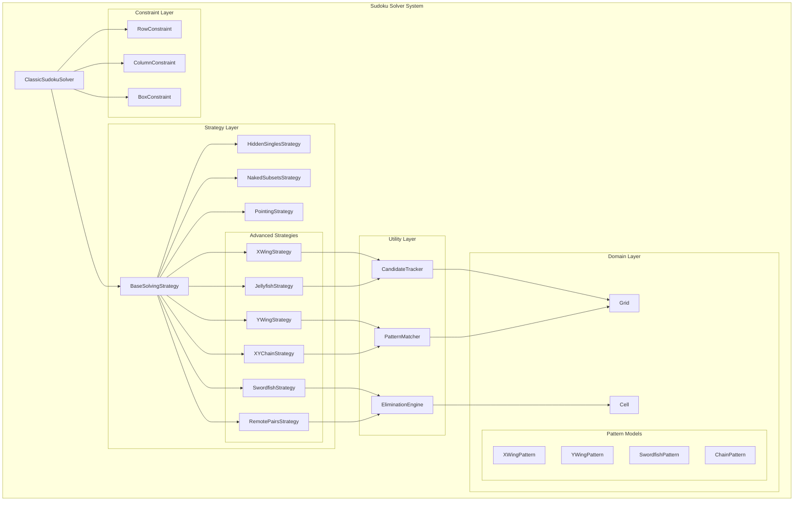
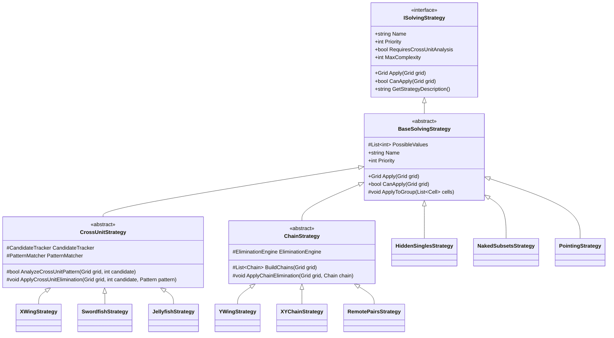
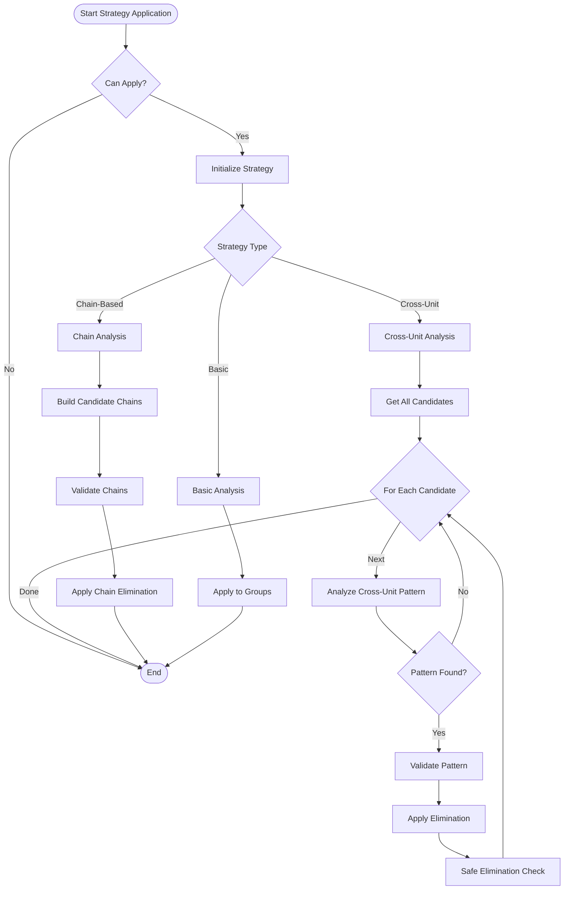
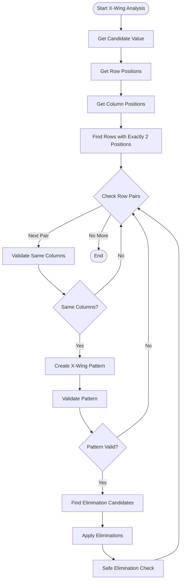
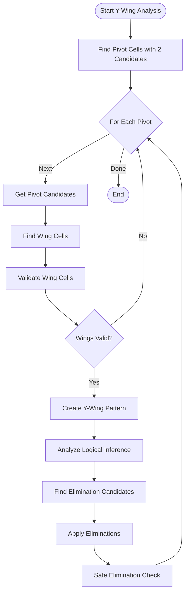
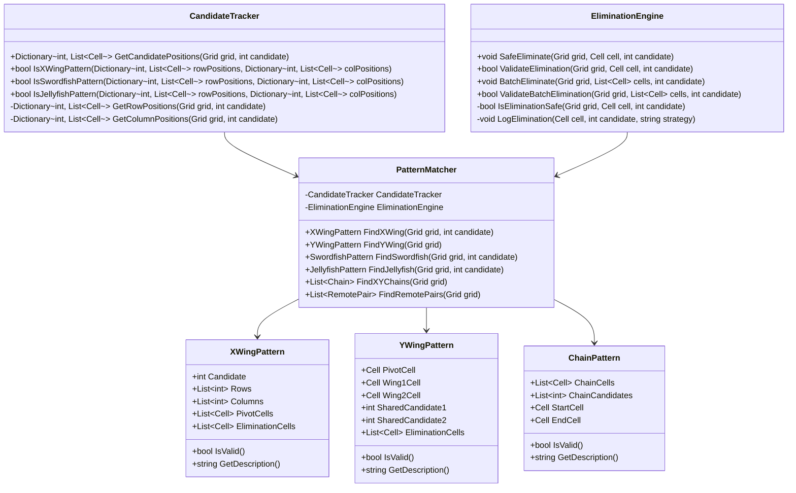
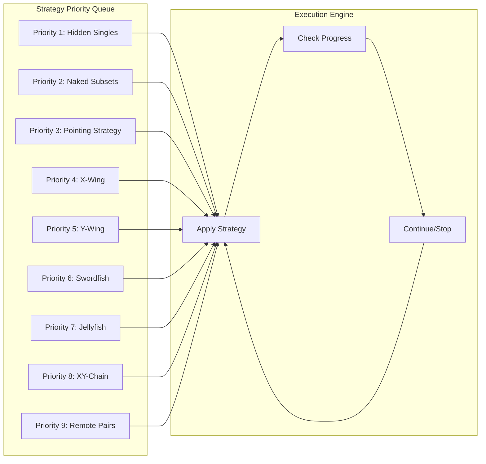
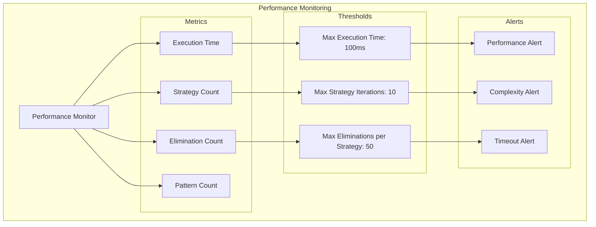
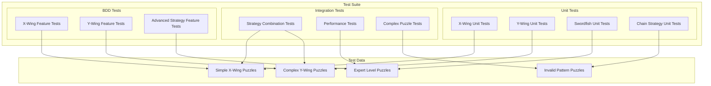
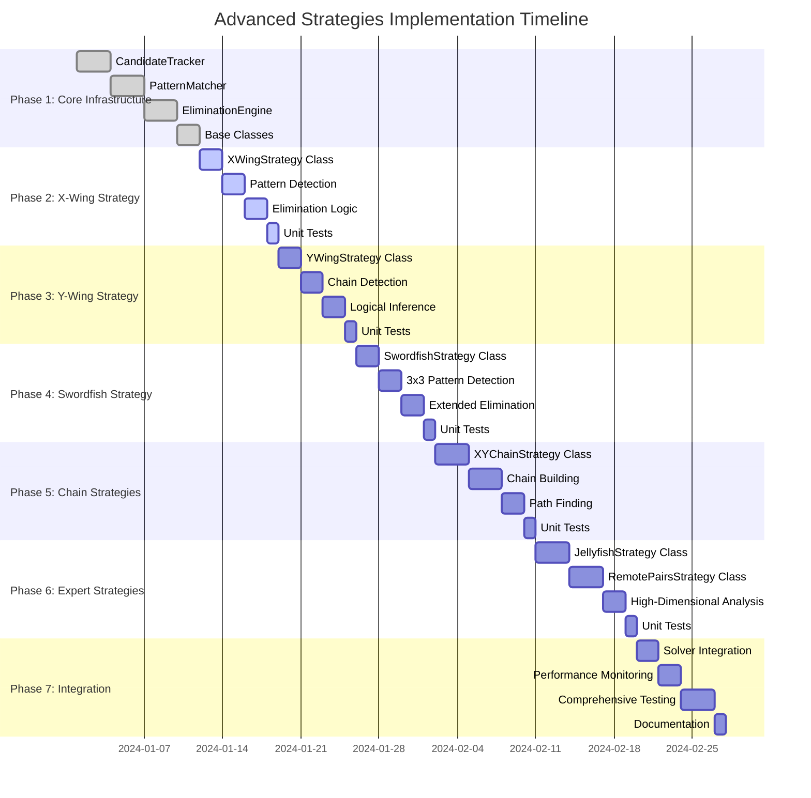

# PLAN-002: Advanced Strategies Architecture Diagrams

## Architecture Overview

This document provides detailed architecture diagrams and technical specifications for the advanced Sudoku solving strategies expansion.

## 1. High-Level Architecture

## 2. Strategy Inheritance Hierarchy

## 3. Advanced Strategy Flow Diagram

## 4. X-Wing Strategy Detailed Flow

## 5. Y-Wing Strategy Detailed Flow

## 6. Utility Classes Architecture

## 7. Strategy Priority and Execution Flow

## 8. Performance Monitoring Architecture

## 9. Testing Architecture

## 10. Implementation Timeline with Dependencies

## Technical Implementation Notes

### 1. Performance Considerations
- **Early Termination**: Each strategy should implement early termination conditions
- **Caching**: Cache candidate positions and pattern results where appropriate
- **Complexity Limits**: Set maximum complexity thresholds for each strategy
- **Memory Management**: Use efficient data structures and avoid unnecessary allocations

### 2. Safety and Validation
- **Elimination Validation**: All eliminations must be validated before application
- **Pattern Validation**: All patterns must be validated for correctness
- **Rollback Capability**: Ability to rollback changes if validation fails
- **Logging**: Comprehensive logging for debugging and analysis

### 3. Extensibility
- **Strategy Interface**: Maintain clean interfaces for easy extension
- **Pattern Recognition**: Modular pattern recognition for easy addition of new patterns
- **Utility Classes**: Reusable utility classes for common operations
- **Configuration**: Configurable parameters for strategy behavior

### 4. Testing Strategy
- **Unit Tests**: Comprehensive unit tests for each strategy
- **Integration Tests**: Tests for strategy combinations and interactions
- **Performance Tests**: Benchmarks for strategy performance
- **Edge Case Tests**: Tests for edge cases and error conditions

This architecture provides a solid foundation for implementing advanced Sudoku solving strategies while maintaining performance, safety, and extensibility. 