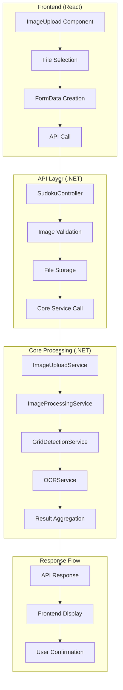
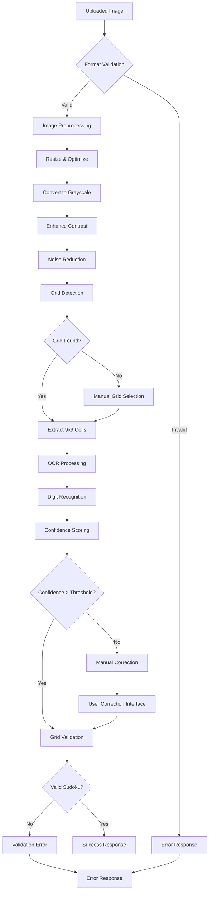
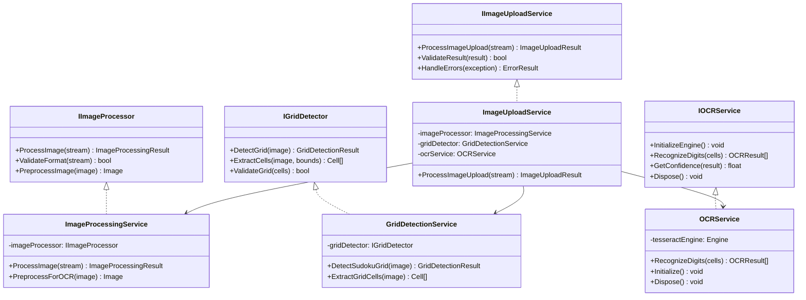
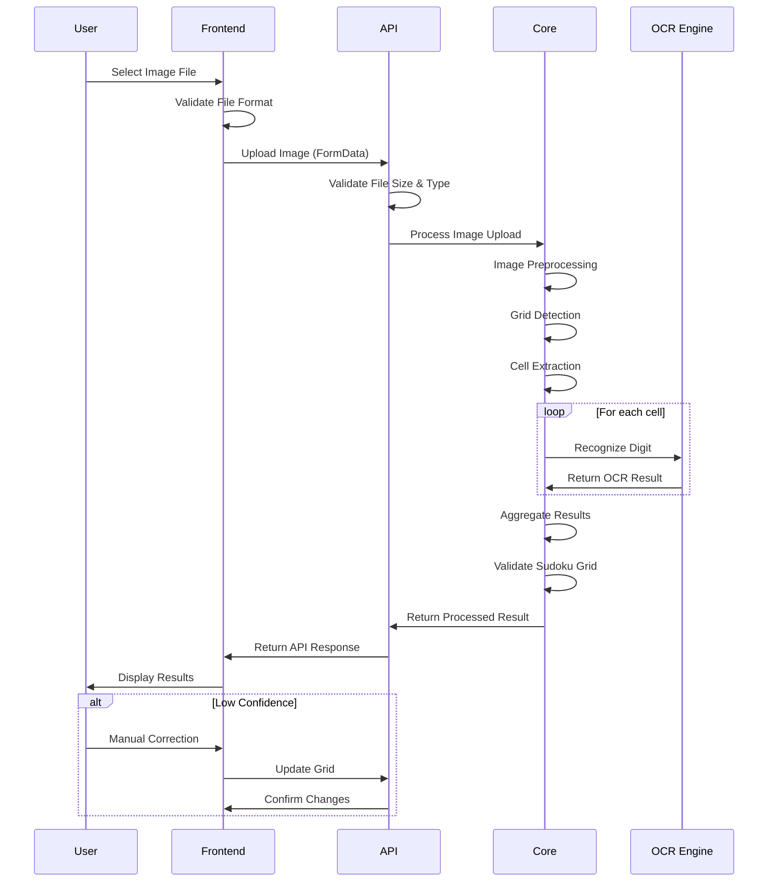
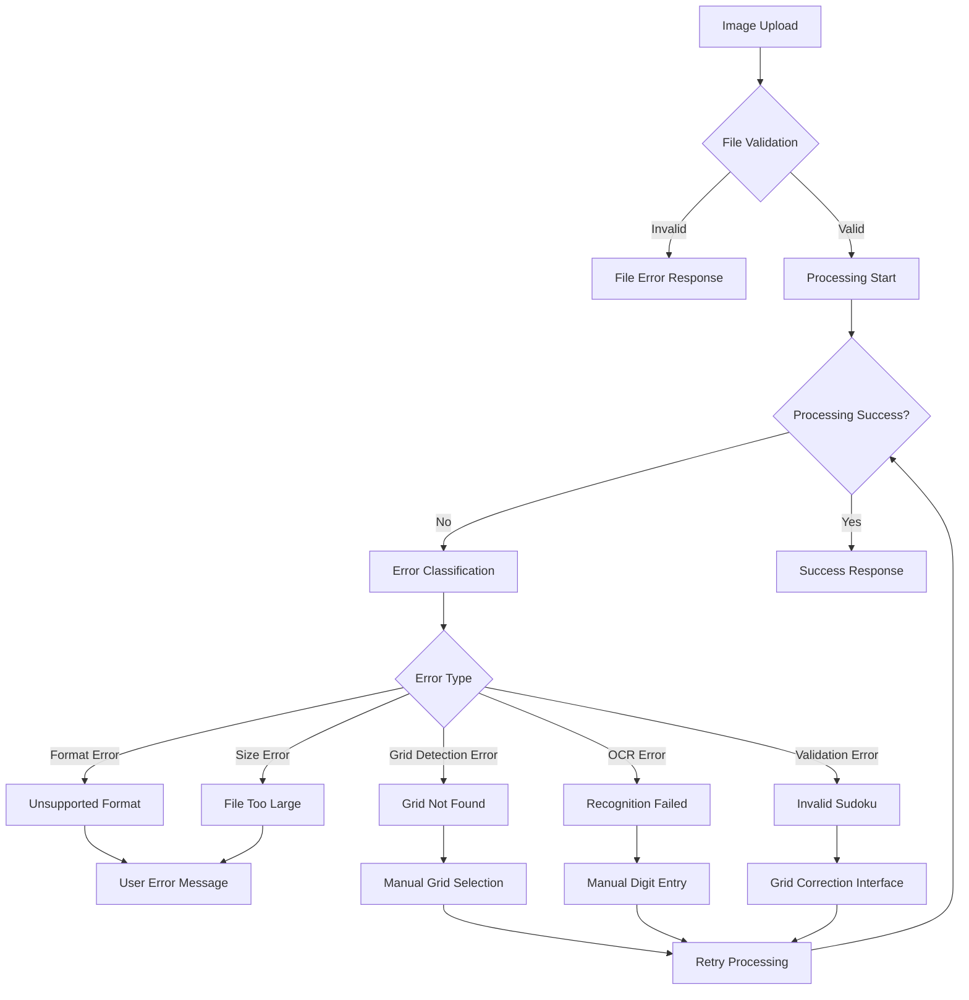
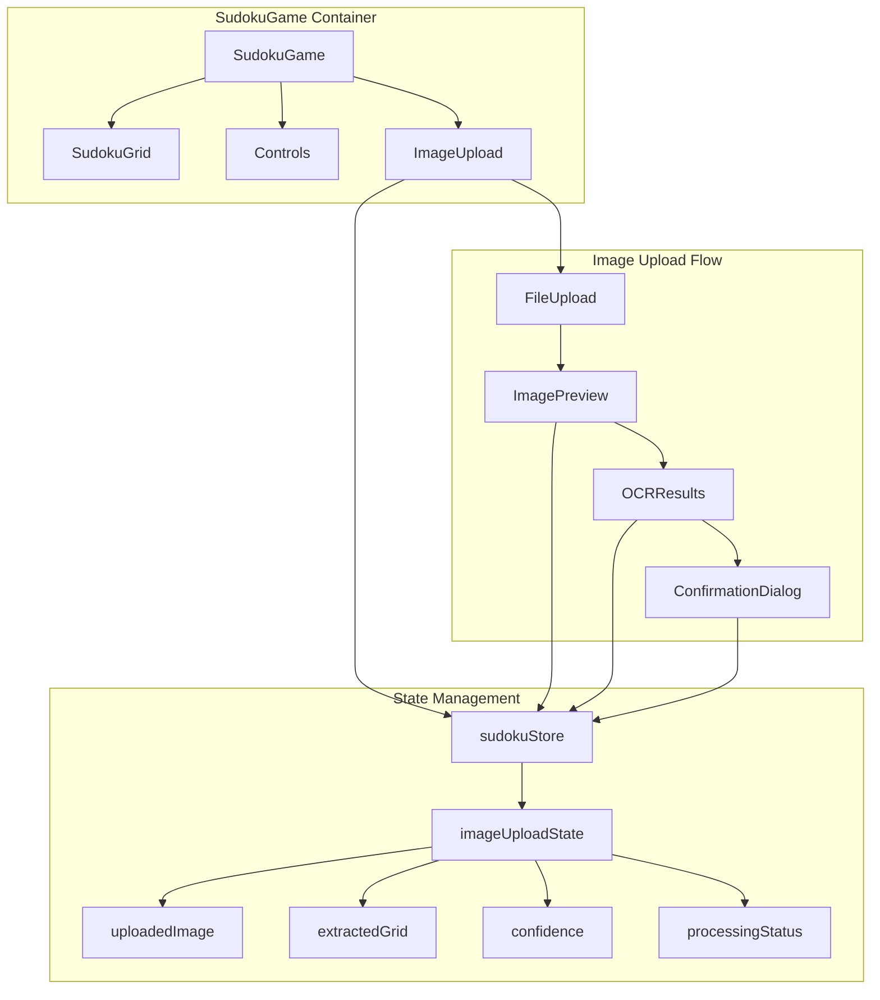
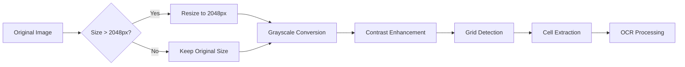
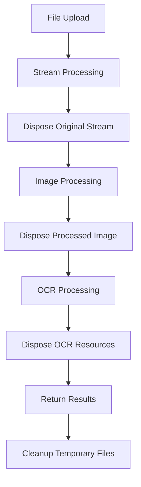
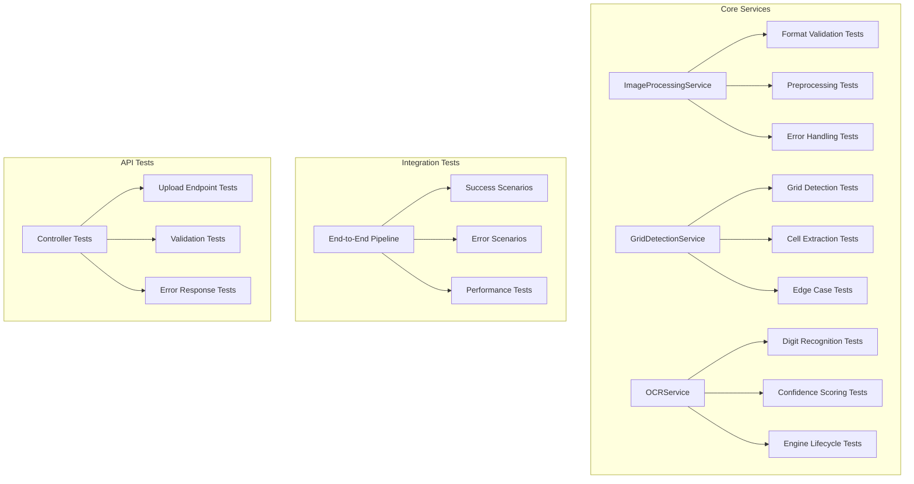
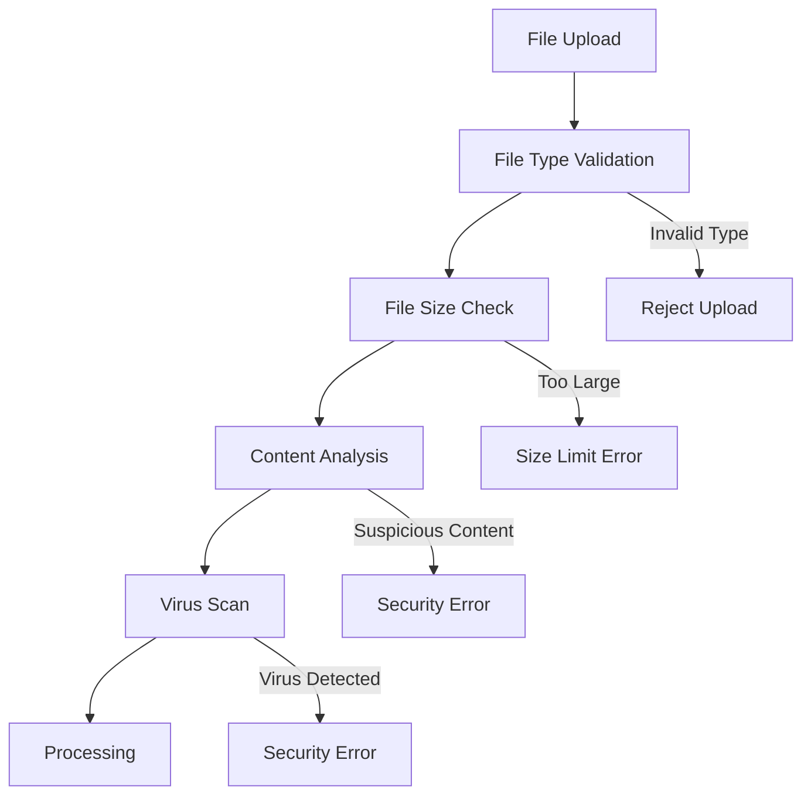

# PLAN-002: Technical Specification for Image Upload and OCR Feature

## System Architecture Overview



## Image Processing Pipeline



## Core Service Architecture



## Data Flow Sequence



## Error Handling Flow



## Frontend Component Architecture



## API Endpoint Specification

### Image Upload Endpoint

```http
POST /api/sudoku/upload-image
Content-Type: multipart/form-data

Request:
- image: File (JPEG, PNG, WebP, max 10MB)
- options: ImageProcessingOptions (optional)

Response:
{
  "success": true,
  "data": {
    "extractedGrid": number[][],
    "confidence": number[][],
    "processingTime": number,
    "warnings": string[],
    "previewUrl": string
  },
  "correlationId": string
}
```

### Error Response Format

```json
{
  "success": false,
  "error": {
    "type": "ValidationError|ProcessingError|OCRError",
    "message": "Human readable error message",
    "details": {
      "field": "Specific field causing error",
      "value": "Invalid value",
      "suggestion": "Suggested fix"
    }
  },
  "correlationId": string
}
```

## Performance Considerations

### Image Processing Optimization



### Memory Management Strategy



## Testing Strategy

### Unit Test Coverage



## Security Considerations

### File Upload Security



## Implementation Checklist

### Phase 1: Core Infrastructure
- [ ] Add NuGet packages to Core project
- [ ] Create Core interfaces
- [ ] Create Core models
- [ ] Set up Tesseract training data
- [ ] Configure build settings

### Phase 2: Core Services
- [ ] Implement ImageProcessingService
- [ ] Implement GridDetectionService
- [ ] Implement OCRService
- [ ] Implement ImageUploadService
- [ ] Add unit tests for each service

### Phase 3: API Integration
- [ ] Add API models
- [ ] Enhance SudokuController
- [ ] Add image validation middleware
- [ ] Configure file upload settings
- [ ] Add integration tests

### Phase 4: Frontend Implementation
- [ ] Add TypeScript types
- [ ] Enhance API service
- [ ] Update Zustand store
- [ ] Create UI components
- [ ] Integrate with existing UI

### Phase 5: Testing & Optimization
- [ ] Complete unit test coverage
- [ ] Performance testing
- [ ] User acceptance testing
- [ ] Security testing
- [ ] Documentation updates

## Risk Mitigation Strategies

### OCR Accuracy Issues
- Implement confidence thresholds (reject < 70% confidence)
- Provide manual correction interface
- Use multiple OCR passes with different preprocessing
- Train Tesseract specifically for digit recognition

### Grid Detection Failures
- Implement multiple detection algorithms
- Allow manual grid boundary selection
- Provide visual feedback for detection results
- Support different grid styles and layouts

### Performance Issues
- Implement image resizing before processing
- Use async processing with progress indicators
- Add timeout mechanisms
- Implement caching for repeated operations

### Memory Management
- Proper disposal of image resources
- Streaming for large files
- Garbage collection optimization
- Memory usage monitoring

## Success Metrics

### Functional Metrics
- OCR accuracy > 90% for clear images
- Grid detection success rate > 95%
- Processing time < 10 seconds for standard images
- Error rate < 5% for valid uploads

### Performance Metrics
- Memory usage < 500MB for 10MB images
- CPU usage < 80% during processing
- Response time < 15 seconds total
- Concurrent upload support > 5 users

### User Experience Metrics
- User satisfaction > 4.5/5
- Manual correction rate < 10%
- Feature adoption rate > 60%
- Support ticket reduction > 50% 