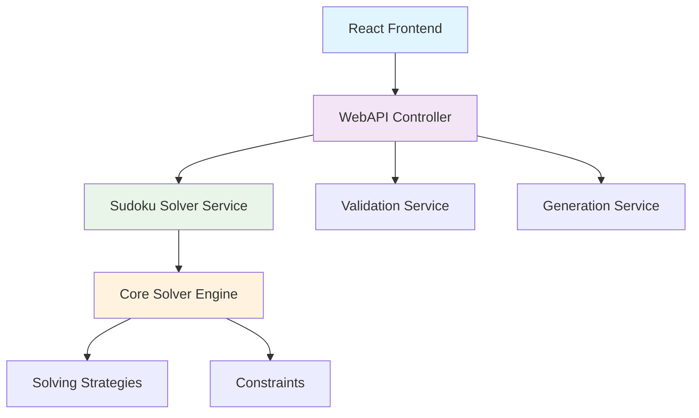
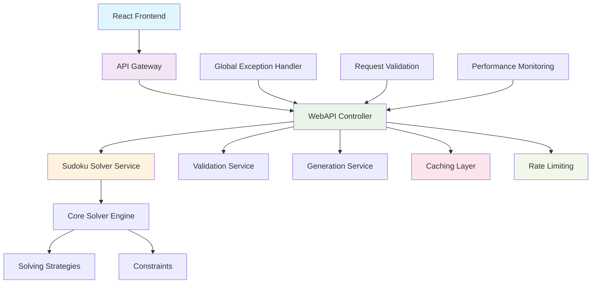

# PLAN-003: WebAPI Structure Preparation for Sudoku Solver

## Executive Summary

This plan outlines the comprehensive preparation of the WebAPI structure for the Sudoku solver project, ensuring that the backend is fully responsible for solving and returning solved grids or unable-to-solve errors, while the frontend handles only simple validation.

## Current State Analysis

### ✅ Existing Infrastructure
- **WebAPI Project**: `SudokuSolver.WebApp` with ASP.NET Core
- **API Endpoints**: Solve, Validate, Generate endpoints implemented
- **Core Solver**: Robust `ClassicSudokuSolver` with multiple strategies
- **React Integration**: API service layer ready in React app
- **CORS Configuration**: Configured for React app communication
- **Swagger Documentation**: Basic API documentation available

### 🔧 Areas Requiring Improvement
1. **Error Handling**: Inconsistent error response formats
2. **Input Validation**: Basic validation needs enhancement
3. **Response Standardization**: Missing standardized API response wrapper
4. **Puzzle Generation**: Placeholder implementation needs completion
5. **Performance Optimization**: No caching or rate limiting
6. **Security**: Missing input sanitization and validation
7. **Logging**: Basic logging needs enhancement
8. **API Documentation**: Swagger documentation needs improvement

## Detailed Implementation Plan

### 1. API Response Standardization

#### 1.1 Enhanced API Response Models
**Location**: `SudokuSolver.WebApp/Models/`

**Changes Required**:
- [ ] Create standardized `ApiResponse<T>` wrapper for all responses
- [ ] Implement `SudokuSolveResponse` with detailed solving information
- [ ] Create `SudokuValidationResponse` with validation details
- [ ] Add `SudokuGenerationResponse` with generation metadata
- [ ] Implement `ErrorResponse` with consistent error format

**Risk Analysis**:
- **Risk**: Breaking changes to existing API consumers
- **Mitigation**: Maintain backward compatibility with versioning

#### 1.2 Error Handling Enhancement
**Location**: `SudokuSolver.WebApp/Controllers/`

**Changes Required**:
- [ ] Implement global exception handling middleware
- [ ] Create custom exception types for different error scenarios
- [ ] Standardize error response format across all endpoints
- [ ] Add detailed error logging with correlation IDs

### 2. Input Validation and Security

#### 2.1 Enhanced Input Validation
**Location**: `SudokuSolver.WebApp/Controllers/SudokuController.cs`

**Changes Required**:
- [ ] Implement comprehensive grid validation (size, values, format)
- [ ] Add difficulty level validation for generation endpoint
- [ ] Implement input sanitization to prevent injection attacks
- [ ] Add request size limits and rate limiting

#### 2.2 Security Enhancements
**Location**: `SudokuSolver.WebApp/Program.cs`

**Changes Required**:
- [ ] Add request validation middleware
- [ ] Implement API key authentication (optional)
- [ ] Add request/response logging for security monitoring
- [ ] Configure HTTPS enforcement

### 3. Backend Solving Responsibility

#### 3.1 Enhanced Solve Endpoint
**Location**: `SudokuSolver.WebApp/Controllers/SudokuController.cs`

**Changes Required**:
- [ ] Implement comprehensive solving logic with multiple strategies
- [ ] Add solving progress tracking and timeout handling
- [ ] Return detailed solving information (steps taken, time elapsed)
- [ ] Handle unsolvable puzzles with proper error messages
- [ ] Add solving difficulty assessment

#### 3.2 Puzzle Generation Implementation
**Location**: `SudokuSolver.WebApp/Services/`

**Changes Required**:
- [ ] Create `PuzzleGenerationService` with actual generation logic
- [ ] Implement difficulty-based puzzle generation
- [ ] Add puzzle uniqueness validation
- [ ] Create puzzle database for storing generated puzzles

### 4. Frontend Simple Validation

#### 4.1 Client-Side Validation Enhancement
**Location**: `SudokuSolver.ReactApp/src/services/utils/`

**Changes Required**:
- [ ] Implement basic grid format validation
- [ ] Add real-time input validation for user experience
- [ ] Create validation utilities for common checks
- [ ] Implement optimistic UI updates with rollback

#### 4.2 API Integration Optimization
**Location**: `SudokuSolver.ReactApp/src/services/api/`

**Changes Required**:
- [ ] Update API service to handle new response formats
- [ ] Implement retry logic for failed requests
- [ ] Add request caching for better performance
- [ ] Create offline validation fallback

### 5. Performance and Scalability

#### 5.1 Caching Implementation
**Location**: `SudokuSolver.WebApp/Services/`

**Changes Required**:
- [ ] Implement Redis caching for solved puzzles
- [ ] Add memory caching for frequently accessed data
- [ ] Create cache invalidation strategies
- [ ] Implement cache warming for common puzzles

#### 5.2 Performance Monitoring
**Location**: `SudokuSolver.WebApp/`

**Changes Required**:
- [ ] Add performance metrics collection
- [ ] Implement request timing middleware
- [ ] Create health check endpoints
- [ ] Add resource usage monitoring

### 6. API Documentation and Testing

#### 6.1 Enhanced Swagger Documentation
**Location**: `SudokuSolver.WebApp/`

**Changes Required**:
- [ ] Add comprehensive API documentation with examples
- [ ] Implement response schema documentation
- [ ] Add error code documentation
- [ ] Create interactive API testing interface

#### 6.2 API Testing Suite
**Location**: `SudokuSolver.WebApp.Tests/`

**Changes Required**:
- [ ] Create integration tests for all endpoints
- [ ] Implement performance tests for solving algorithms
- [ ] Add load testing for concurrent requests
- [ ] Create API contract tests

## Implementation Checklist

### Phase 1: Core API Enhancement (Week 1)
1. [ ] Create enhanced API response models
2. [ ] Implement global exception handling middleware
3. [ ] Standardize error response format
4. [ ] Add comprehensive input validation
5. [ ] Update existing endpoints to use new response format

### Phase 2: Backend Solving Enhancement (Week 2)
1. [ ] Implement comprehensive solving logic
2. [ ] Create puzzle generation service
3. [ ] Add solving progress tracking
4. [ ] Implement timeout handling
5. [ ] Add difficulty assessment

### Phase 3: Security and Performance (Week 3)
1. [ ] Implement request validation middleware
2. [ ] Add caching layer
3. [ ] Implement rate limiting
4. [ ] Add performance monitoring
5. [ ] Configure security headers

### Phase 4: Frontend Integration (Week 4)
1. [ ] Update React API service
2. [ ] Implement client-side validation
3. [ ] Add retry logic and error handling
4. [ ] Create offline validation fallback
5. [ ] Update UI components for new API responses

### Phase 5: Testing and Documentation (Week 5)
1. [ ] Create comprehensive API tests
2. [ ] Implement performance tests
3. [ ] Add load testing
4. [ ] Enhance Swagger documentation
5. [ ] Create API usage examples

### Phase 6: Deployment and Monitoring (Week 6)
1. [ ] Configure production environment
2. [ ] Set up monitoring and alerting
3. [ ] Implement logging aggregation
4. [ ] Create deployment scripts
5. [ ] Perform final testing and validation

## Risk Assessment and Mitigation

### High-Risk Items
1. **API Breaking Changes**
   - **Risk**: Existing clients may break
   - **Mitigation**: Implement API versioning and backward compatibility

2. **Performance Degradation**
   - **Risk**: Complex solving algorithms may slow down API
   - **Mitigation**: Implement caching and async processing

3. **Security Vulnerabilities**
   - **Risk**: Input validation gaps may lead to attacks
   - **Mitigation**: Comprehensive input validation and sanitization

### Medium-Risk Items
1. **Scalability Issues**
   - **Risk**: High concurrent usage may overwhelm system
   - **Mitigation**: Implement rate limiting and horizontal scaling

2. **Data Consistency**
   - **Risk**: Cached data may become stale
   - **Mitigation**: Implement proper cache invalidation strategies

## Success Metrics

### Performance Metrics
- [ ] API response time < 500ms for solve requests
- [ ] 99.9% uptime for API endpoints
- [ ] Support for 100+ concurrent users
- [ ] Cache hit ratio > 80%

### Quality Metrics
- [ ] 100% test coverage for API endpoints
- [ ] Zero security vulnerabilities
- [ ] Comprehensive API documentation
- [ ] Successful integration with React frontend

### User Experience Metrics
- [ ] Frontend validation response time < 100ms
- [ ] Smooth error handling and user feedback
- [ ] Intuitive API usage patterns
- [ ] Consistent response formats

## Architecture Diagrams

### Current Architecture

### Target Architecture

## Finalization Actions

1. [ ] Complete all implementation tasks
2. [ ] Perform comprehensive testing
3. [ ] Update documentation
4. [ ] Deploy to production environment
5. [ ] Monitor system performance
6. [ ] Gather user feedback
7. [ ] Iterate based on feedback
8. [ ] Final validation and sign-off

## Conclusion

This plan provides a comprehensive roadmap for preparing the WebAPI structure for the Sudoku solver project. The focus is on ensuring that the backend takes full responsibility for solving puzzles while providing a robust, secure, and performant API for the React frontend to consume. The implementation will be done in phases to minimize risk and ensure quality delivery. 